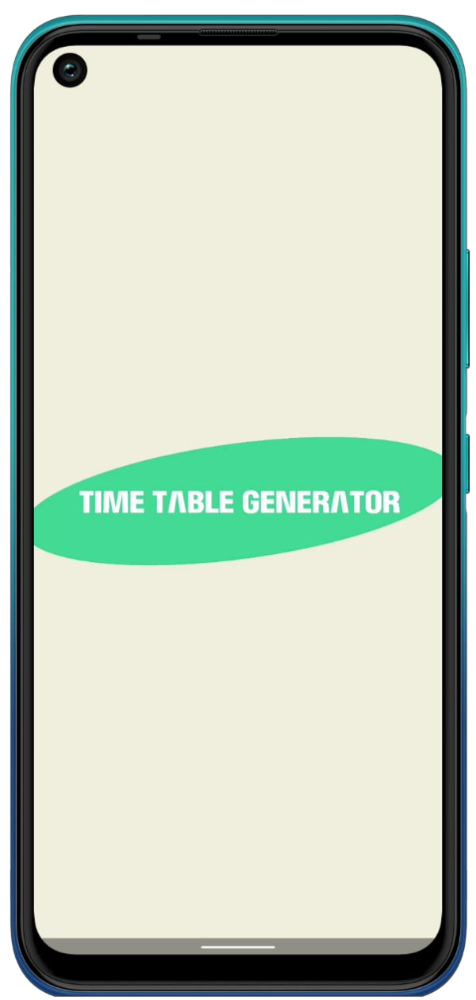
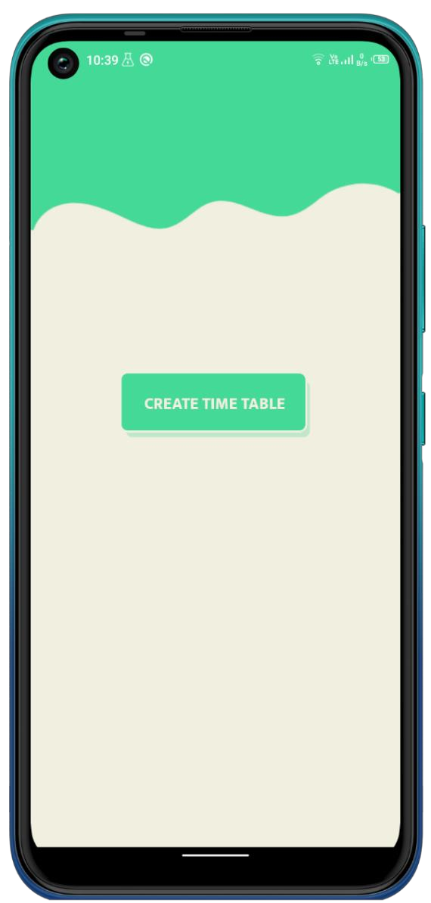
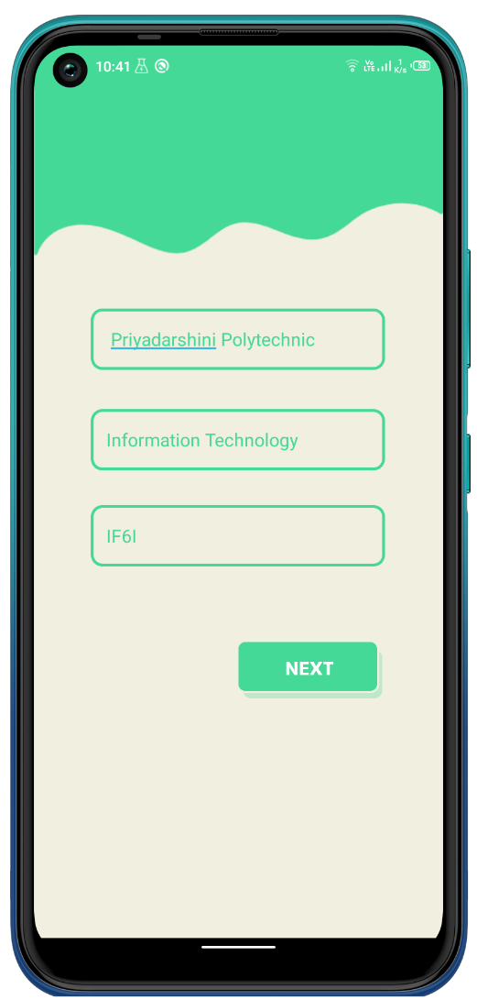
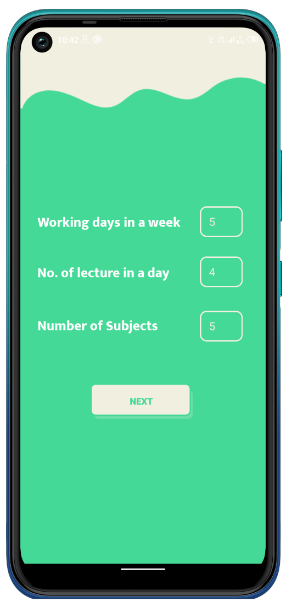
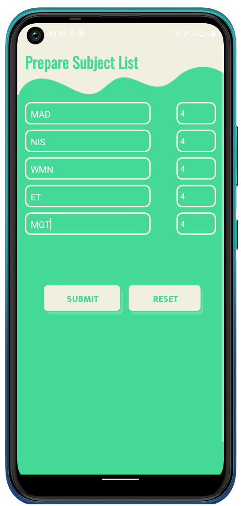
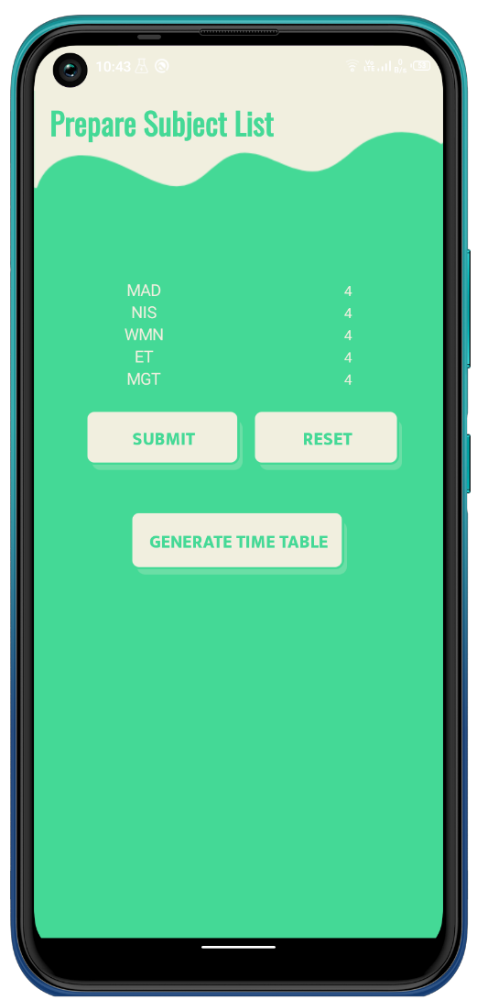
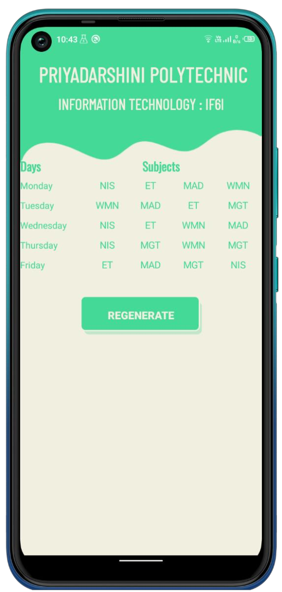
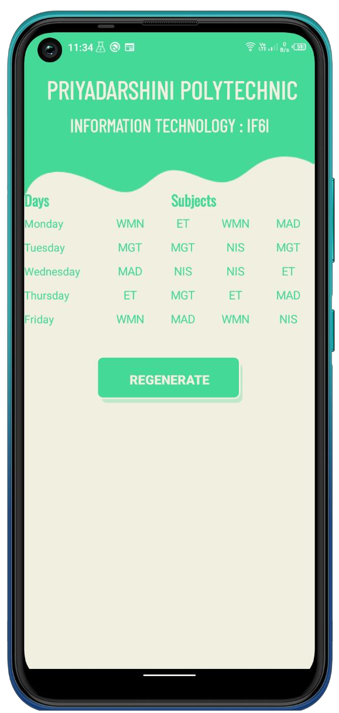

# TimeTable Generator
## Overview
TimeTable Generator is an Android application designed to assist organizational authorities in creating timetables without any conflicts efficiently. The software considers various factors such as class name, number of working days in a week, number of subjects, number of lectures in a day, subject combinations, and preferred time slots to generate a conflict-free timetable suitable for all parties involved. This app offers a user-friendly interface to input courses, allocate time slots, and ensure no clashes in the schedule. The application is developed using Java for Android.

## Technologies Used
  1. Java: Core programming language.
  2. Android SDK: Development framework.

## Screenshots

